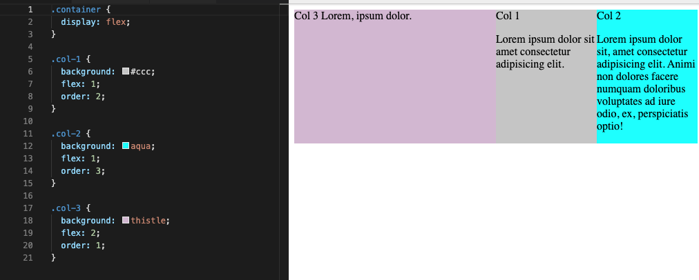
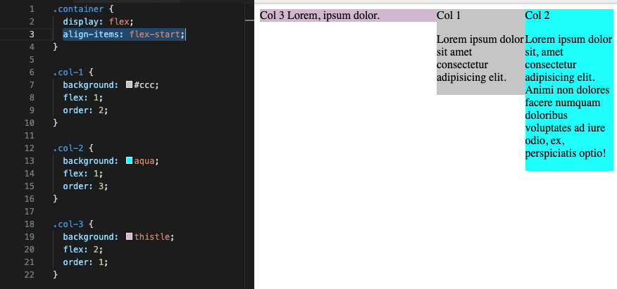
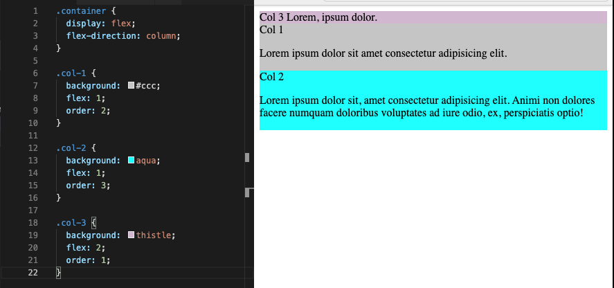
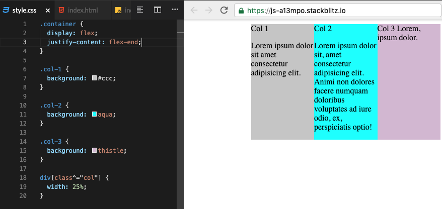
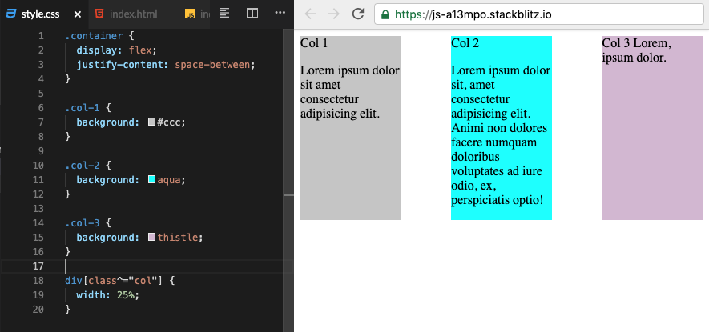
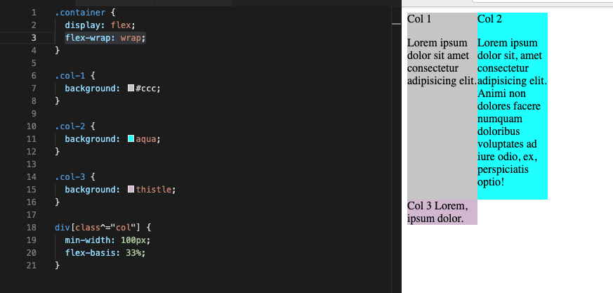

### Flexbox main props


---
```css
align-items: flex-start;
```

---
```css
flex-direction: column;
```

---
```css
justify-content: flex-end;
```

---
```css
justify-content: space-between;
```


`space-around` is similar prop

---
```css
justify-content: space-between;
```
and
```css
flex-wrap: wrap;
```

