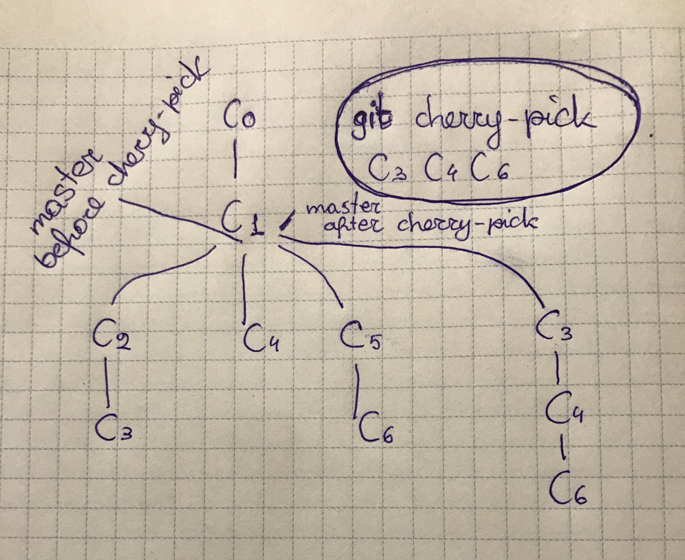

#### Chery-pick
Copy required commits (commit hash) to current branch



---

`git push origin HEAD` - push to current branch

To ignore some ALREADY TRACKED file and to do not checkout/push changes from it to repo
git update-index --assume-unchanged somefile.js

> git rename branch

```
git branch -m old_branch new_branch         # Rename branch locally    
git push origin :old_branch                 # Delete the old branch    
git push --set-upstream origin new_branch   # Push the new branch, set local branch to track the new remote
```
