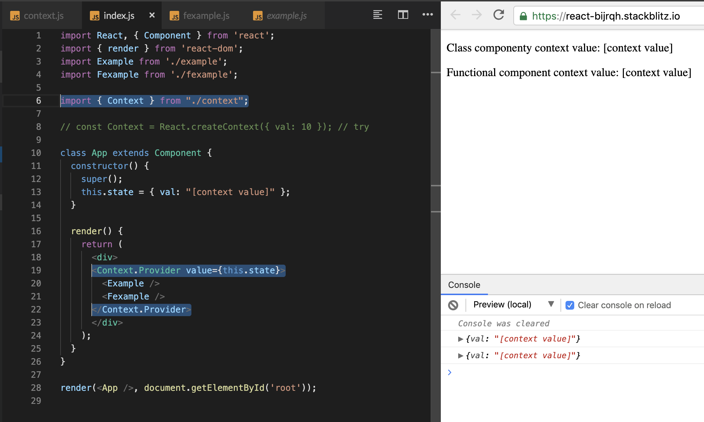
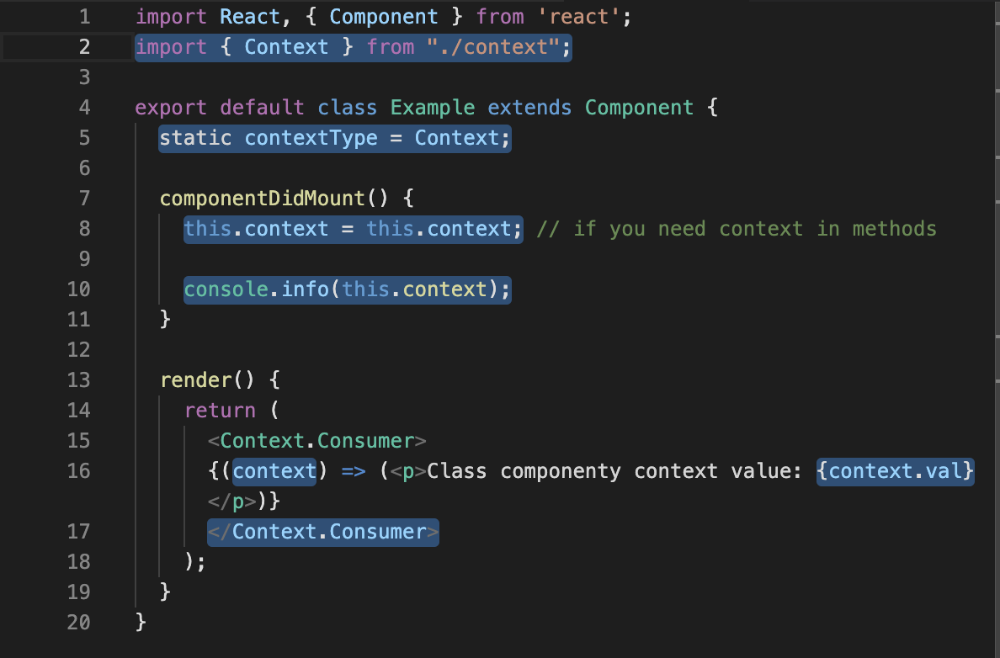
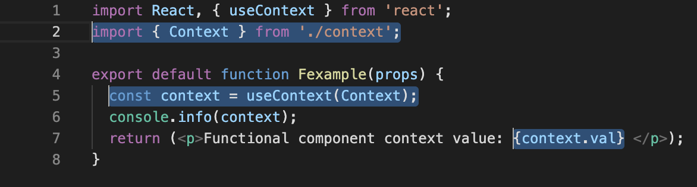
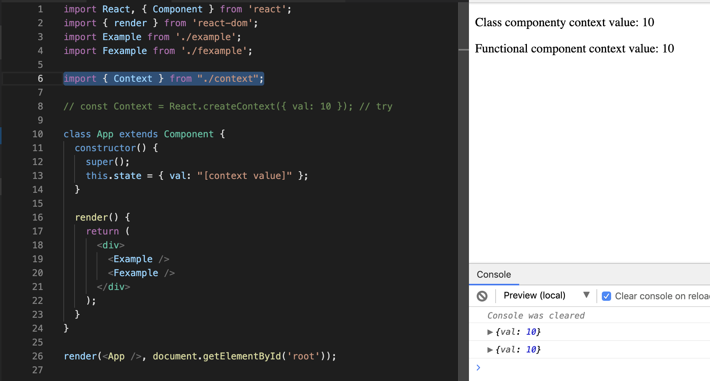

### React context

> `index.js` where context provider is set

---

> `context.js` where context is created

---

> `example.js` class component, that uses created context

---

> `fexample.js` functional component, that uses created context

---

> `index.js` case, when default value of context is used

